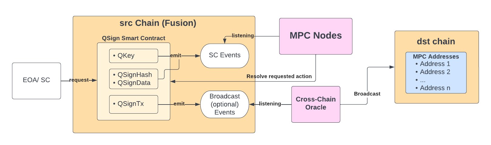

[comment]: # (This template is meant to be included in our PoCs' project repositories. It focuses on general- as well as technical information that should help the reader to get a better understanding of what this PoC aims to accomplish. Copy the markdwon below and paste it in your repo. Fill the text area with information related to the questions and please don't change the headlines)

# QSign 

# Table of Contents
1. [Status](#status)
2. [Introduction](#introduction)
    1. [Summary](#summary)
    2. [Motivation](#motivation)
    3. [Commercial Use Case](#commercial-use-case)
3. [Technical Overview](#technical-overview)
    1. [Solution Architecture](#solution-architecture)
    2. [Dependencies](#dependencies)
    3. [Security Considerations](#security-considerations)
4. [Acceptance Criteria](#acceptance-criteria)
5. [Learnings and Citations](#learnings-and-citations)
    1. [Learnings](#learnings)
    2. [Citations](#citations)

## Status

Active

[Back top](#table-of-contents)

## Header

Name: QSign - Programmable MPC-backed Messaging and Key Generation

Proposer: n/a

Engineer Owner: Venimir Petkov

Status: In progress

Proposal date: 01.07.2022

[Back top](#table-of-contents)

## Introduction

### Summary

QSign is Qredo's answer to achieve cross-chain interoperability between different blockchains. It enables managing funds and assets on different chains from one single account on one blockchain by interacting with the QSigns smart contracts which allow for advanced programmable signing capabilities in combination with Multi-Party Computation. 

Today we see a lot of emerging L1 blockchains and scaling L2 solutions and yet more new networks to come. Storage of assets and running dApps on such emerging chains or building cross-chain dApps are challenging due to several reasons. 

- First, it is hard to bootstrap liquidity on new chains due to poor user experience and the associated risks
- Second, maintenance of the cross-chain application requires a lot of engineering and operational efforts and even then it is likely to be centralised.
- Third, there is a lack of flexibility and tooling for secure cross-chain messaging

The QSign service allows users to create keyless wallets, which are programmatically controlled by smart contracts and Qredos MPC network. It provides a tool for dApp developers and blockchain platform teams to build cross-chain as QSign allows to manage accounts on other supported blockchains as well.

[Back top](#table-of-contents)

### Motivation

An EVM contract is not able to generate signatures for transactions. QSign aims to fix this shortcoming by enabling contracts to trigger the generation of keys and signatures of arbitrary data, outside of the contract. This is achieved by levering the existing Qredo MPC architecture together with the Cross-Chain Oracle (CCO) technology.

QSign, therefore, allows users to manage multiple assets on many different chains within one smart contract and don't have to deal with key management of these generated addresses by trusting Qredo's MPC architecture. This takes one of the biggest burdens off the shoulders of blockchain users.

[Back top](#table-of-contents)

### Commercial Use Case

QSign as a Service can be an attractive product for a large group of potential customers and can build applications for various use cases.

At first, QSign enables secure programmable storage of funds and other on-chain assets with arbitrary administration and logic. Further, QSign can create a set of wallets on different chains that can be controlled and governed by a smart contract from a single chain and, therefore, create a custody layer out of any blockchain. While in the beginning QSign supports the blockchains the QSign Smart Contracts are residing on it can also be scaled to blockchains in the future with no support for smart contracts, like Bitcoin.

Next, we can prove the custody of funds and other assets across many different blockchains - generally speaking - a proof of the state. The cross-chain functionality is useful for instance to delegate intense on-chain computations to cheaper networks, like the on-chain generation of ZK proofs. QSign further allows bootstrapping TVL for cross-chain dApps on matured chains while being primarily deployed on emerging chains with a single click for a user.

Lastly, using QSign can be charged with QRDO tokens which should increase the attractiveness of the token. When using QSign on the Fusion Chain, users can interact with QSign and pay in the native QRDO token of the Fusion Chain.

[Back top](#table-of-contents)

## Technical Overview

QSign is built with Smart Contracts written in solidity that can be deployed on any EVM-compatible blockchain. The smart contracts allow users to create keys, request signatures and request broadcasting of transactions on other supported L1 chains in a manner that many blockchain users are already familiar with. 

Qredo's MPC network is listening to events emitted by the QSign Smart Contract and creates and returns signatures to the respective requests. The MPC network is comprised of MPC clusters that reside on secured hardware maintained by Qredo. 

The cross-chain interoperability is enabled by the CCO which is a type of an off-chain agent that broadcasts signed data emitted from the QSign Smart Contract to the indicated destination blockchain. This could be a signed transaction but also any other arbitrary signed message. The CCO is designed with decentralization in mind, so every user will be able to run their own CCO to relay the messages across various blockchains.

[QSign Smart Contract](../overview/tech-wiki.md#qsign-smart-contract)

[MPC](../overview/tech-wiki.md#mpc)

[CCO](../overview/tech-wiki.md#cco)

[Back top](#table-of-contents)

### Solution Architecture

The following diagram shows the solution architecture of QSign. 

QSign Architecture:

1. The QSign Smart Contract is the go-to access point for users to interact with QSign services to generate a key with the `QKey` function, to request a signature and to broadcast a transaction. Apart from the possibility to request signatures from plain data with the `QSignData` function, Qsign also offers to sign data for encrypted data or hashes with the `QSignHash` function. Lastly, the QSign Smart Contract also provides the option to sign and broadcast a transaction, which will get picked up by the CCO. The QSign Smart Contract deployment is currently primarily focusing on EVM blockchains such as Ethereum, Polygon, or Qredo's Fusion Chain.
2. The MPC network is listening to key generation- or signature request events emitted by the QSign Smart Contract(s). Once an event has been detected, the MPC network fully automatically processes the request and returns the value back to the user. Signatures can only be created for keys previously generated by the MPC network. Once deployed on the Fusion Chain, the MPC nodes will work in parallel to validator nodes which makes it easier to detect requests and publish data.
3. The Cross-Chain Oracle (CCO) is listening solely to broadcast requests event emitted by the `QSignTx` function of the QSign Smart Contract(s). The user inputs unsigned transactions which could be generated in the previous steps. The MPC creates a signature for this transaction and publishes it on the Smart Contract as a braodcast event. This broadcast event gets picked up by the CCO which acts as a relayer and submits the signed transaction on the given destination blockchain.

Do you want to know more about the components what we are talking about? Go check-out our [wiki](../overview/tech-wiki.md)! 

[Back top](#table-of-contents)

### Dependencies

[comment]: # (This paragraphs should include any dependencies like libraries and packages that are required to successfully run or test the system.) 

1. EVM Contract (or libraries for developers) which emits events to CCO Bridge
2. MPC - The current MPC uses the validator process to ensure the request exists in the Qredochain. QSign requests are not originally available in the Qredochain and disabling these checks is undesirable for existing Qredochain security. Adding a separate validator process for QSign requests, or using a completely separate MPCNetwork is a possibility.

[Back top](#table-of-contents)

### Security Considerations

[comment]: # (This paragraoh should include any security considerations. Especially those that we did not implement in the PoC but need to be implemented once it becomes an actual feature/product of Qredo.)

The QSign logic is built with keyless infrastructure in mind enabled by the MPC network. However, users interacting with QSign initially will most likely do this with their own private key. If they lose this key, they will also lose access to the funds in the other wallets. QSign is therefore prone to general smart contract risks as well as risks associated with managing private keys.

The Cross-Chain Oracle is currently a separate component and a potential single point of failure. The CCO is designed to be decentralized, meaning that users could run their individual CCO instance that manages their individual requests or projects. If the user deploy QSign and the CCO to their own projects, they need to assure high availability of the CCO to not miss broadcasting events.

[Back top](#table-of-contents)

## Acceptance Criteria

To determine this PoC a success, the following criteria should be met: 

1. Invoking the QKey function generates and returns a public key by the MPCs.
2. Invoking the QSignData or QSignHash function lets the MPCs create a signatures or proofs that can be used to sign a message or a transaction.
3. The CCO picks up broadcasting events and submits them to the destination chain. 
4. A user gets the Message, Signature, and TxID returned of the user's respective request.
5. Open Sourcing the smart contracts and bringing QSign to an Alpha review state.

[Back top](#table-of-contents)

## Learnings and Citations

### Learnings

[Back top](#table-of-contents)

### Citations

[comment]: # (If you want to cite relevant sources to help understand the PoC or put it in context, please use Harvard Style citations.)

[comment]: # (“Surname, Initial. - Year of publication - ‘Title of article’, Title of Journal, volume number - issue number - , page reference. If accessed online: Available at: DOI or URL - if required - Accessed: date.”)

[Back top](#table-of-contents)